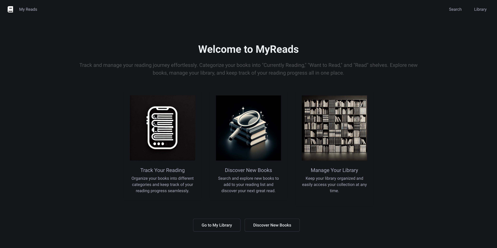
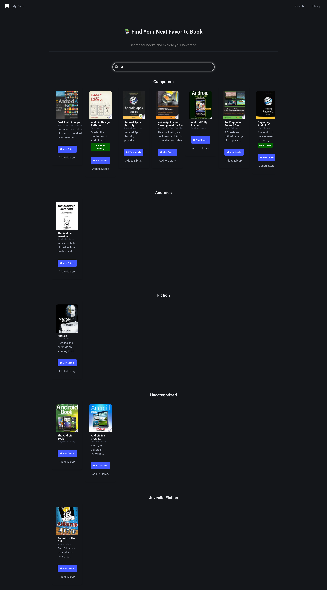
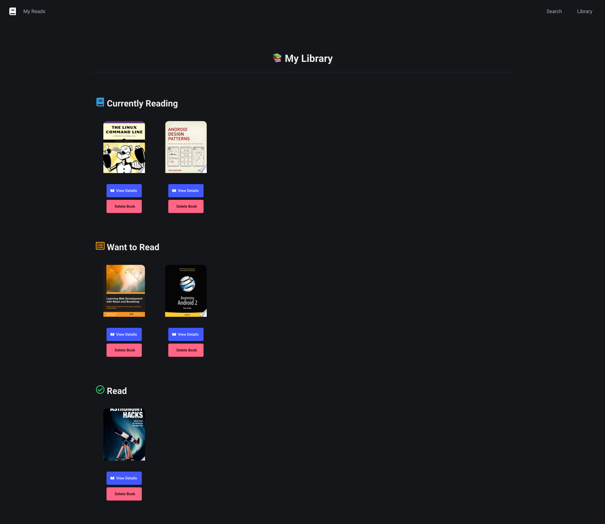
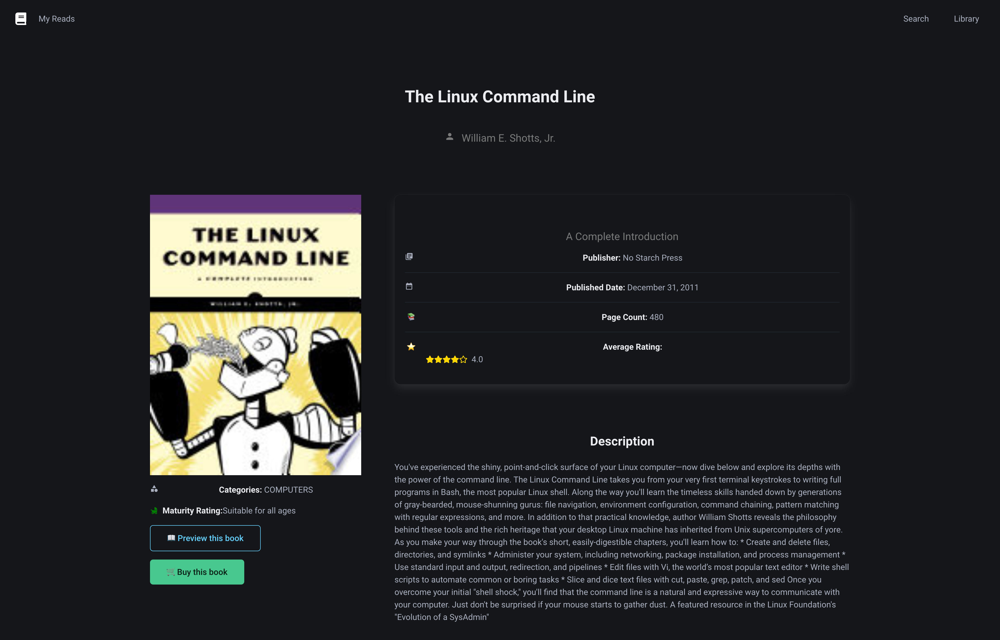

# MyReads: A Book Tracking App

MyReads is a React-based bookshelf application that allows users to categorize and manage books they have read, are currently reading, or want to read. The app provides an intuitive interface to move books between different shelves, search for new books to add to your collection, and more.

## Features

- **Categorize Books**: Organize your books into three categories - "Currently Reading," "Want to Read," and "Read."
- **Move Books Between Shelves**: Easily move books from one shelf to another with a simple selection control.
- **Search for Books**: Find books by searching and add them directly to your library.
- **Book Detail Page**: Click on a book to view more detailed information, including a summary, author details, and publication date.
- **Drag-and-Drop Functionality**: Move books between shelves by dragging and dropping them, providing a more intuitive user experience.
- **Persistent State**: Book selections persist even after page reloads, ensuring your library is always up-to-date.

## Tech Stack

- **React**: Frontend JavaScript library for building user interfaces.
- **React Router**: Handles navigation between the main page, search page, and book detail page.
- **Books API**: Backend service for fetching and managing book data.

## Installation

To run the MyReads app locally on your machine, follow these steps:

1. **Clone the repository**:

   ```bash
   git clone https://github.com/JonathanKSullivan/myreads-app.git
   ```

2. **Navigate to the project directory**:

   ```bash
   cd myreads-app
   ```

3. **Install dependencies**:

   ```bash
   npm install
   ```

4. **Start the development server**:
   ```bash
   npm start
   ```
   This will open the app in your default browser at `http://localhost:3000`.

## Usage

- **Main Page**:
  - View your books organized into "Currently Reading," "Want to Read," and "Read" shelves.
  - Use the control on each book to move it between different shelves.
  - Drag and drop books between shelves for a more interactive experience.
- **Search Page**:

  - Use the search input to find new books by title or author.
  - Add books to your desired shelf directly from the search results.
  - Navigate back to the main page to see your updated library.

- **Book Detail Page**:
  - Click on a book cover or title to navigate to the Book Detail Page.
  - View more detailed information about the book, including its summary, author details, and publication date.
  - Navigate back to the main page or search page to continue managing your library.

## Screenshots






## License

This project is licensed under the MIT License. See the [LICENSE](LICENSE) file for details.

## Acknowledgements

- Special thanks to [Udacity](https://www.udacity.com/) for providing the project and API.
